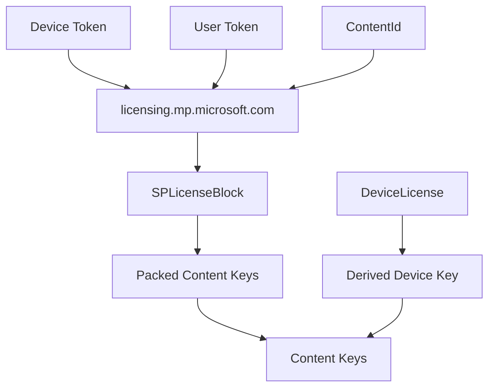

# Licensing flow

> [!NOTE]
> All tokens here are www.microsoft.com

```mermaid
flowchart TD
    Dev["Device Token"] --> Lic["licensing.mp.microsoft.com"]
    Usr["User Token"] --> Lic
    Ct["ContentId"] --> Lic
    Lic --> SpL["SPLicenseBlock"]
    SpL --> EncK["Packed Content Keys"]

    DecLi["DeviceLicense"]
    DK["Derived Device Key"]
    DecLi-->DK

    K["Content Keys"]
    EncK-->K
    DK-->K

```

